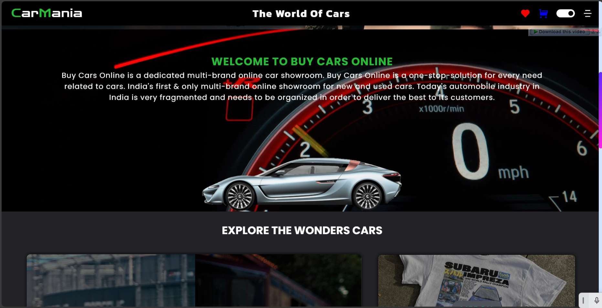

# CarMania - A Car Reselling E-commerce Site

Welcome to CarMania, the premier e-commerce platform catering to all your automotive needs. Whether you're in search of your dream car, stylish merchandise to showcase your passion, or high-quality parts to enhance your vehicle's performance, CarMania has you covered.



## Project Overview
I developed a web application that allows users to browse and purchase cars. The application includes various features such as:

**1. Product Display:** The application displays a list of cars with their names, prices, and images.

**2. Product Details:** When a user clicks on a car, the application displays detailed information about the car, including its fuel type, cylinder configuration, engine type, tank capacity, seating capacity, mileage, and top speed.

**3. Pricing:** The application displays the price of each car in both rupees and currency symbols.

**4. Description:** The application includes a description of each car, highlighting its key features.

**5. Wishlist and Cart:** Users can add cars to their wishlist or cart for later purchase.

**6. Error Handling:** The application includes error handling mechanisms to handle any unexpected errors that may occur during execution.

## Technical Details
The technical details of the project are as follows:

**- Frontend:** The frontend of the application is built using HTML, CSS, and JavaScript.

**- Backend:** The backend of the application is built using Node.js and MongoDB.

**- Database:** The application uses a MongoDB database to store information about the cars.

**- API:** The application uses a RESTful API to interact with the backend and retrieve data from the database.

## Design Patterns
The application follows the Model-View-Controller (MVC) pattern, which is illustrated below:

```plaintext
+-------------+        +------------+       +------------+
|   Model     | <----> | Controller | <----> |   View     |
+-------------+        +------------+       +------------+
|   Data      |        |   Logic    |       |   UI/UX    |
+-------------+        +------------+       +------------+
## Challenges Faced
During the development process, I encountered several challenges:

**- Data Modeling:** Designing a suitable data model for the cars, including the fields and schema for the MongoDB database, was challenging.

**- Error Handling:** Implementing effective error handling mechanisms to handle unexpected errors and exceptions posed a challenge.

**- Frontend-Backend Integration:** Integrating the frontend and backend of the application required careful planning and execution.

